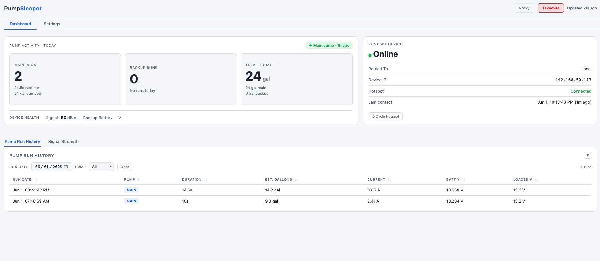
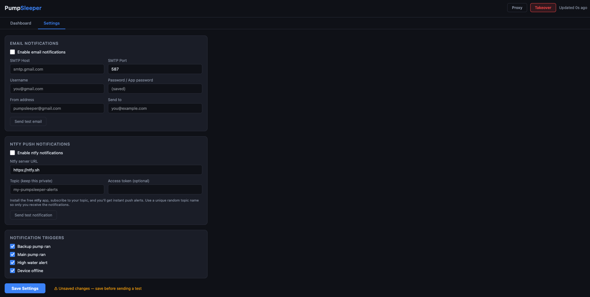

# PumpSleeper

A local proxy and dashboard for **PumpSpy** sump pump monitors. PumpSleeper sits between your PumpSpy device and pumpspy.com, logging every event locally and giving you full control — even when the PumpSpy cloud is down.

## Features

- **Three PumpSpy devices supported** — the **battery backup system** (BBS), the **SO1000 smart outlet**, and the **SmartPump**; pick yours in Settings → PumpSpy Device. Pump runs, alerts, and (on the smart outlet) water-sensor status are all captured. One connected device at a time
- **Local interception & logging** — PumpSleeper sits inline with your device and records every event locally, giving you a complete history independent of the pumpspy.com cloud
- **Works when the cloud is down** — PumpSleeper answers the device directly, so monitoring keeps running even if pumpspy.com is unreachable
- **Local dashboard** — an at-a-glance view of today's pump activity (main/backup runs, gallons, operating status), full pump run history, and signal-strength + battery trends; with the smart outlet selected, a live water-sensor status (Dry / HIGH) replaces the backup-pump stats
- **Secure login** — the dashboard requires a single-user sign-in (default `admin` / `admin`, which you're prompted to change), with a "Forgot password?" flow that sends a reset link to your notification channels
- **Remote web access** — expose the dashboard over the internet through a Cloudflare tunnel: a zero-config quick tunnel (no account) or your own named tunnel for a stable address on your domain. The current URL is shown in Settings and pushed to your notifications
- **Notifications** — email (SMTP, with support for multiple recipients) and ntfy push for backup/main pump runs, high-water alerts, device offline, and update events; each notification includes a tap-through link to the dashboard. Settings save automatically — no Save button
- **Device status** — real-time WiFi hotspot presence check, device IP display, hotspot cycle button
- **Save Log** — one-click export of the recent service logs (Settings → Debug) for troubleshooting
- **Home Assistant integration** — 19 MQTT entities with auto-discovery; custom Lovelace card included
- **Self-update** — checks GitHub for new releases; auto-installs overnight or apply manually from the dashboard
- **Pre-built Pi image** — flash and go; edit one config file on the SD card and PumpSleeper installs itself (and sets its hostname to `pumpsleeper`) on first boot

## Screenshots





---

## Hardware requirements

| Component | Requirement |
|-----------|-------------|
| Storage | 8GB+ microSD card |
| OS | Raspberry Pi OS Bookworm (handled automatically by the pre-built image) |

### Recommended hardware

| Board | Price | Ethernet | Auto-update | Notes |
|-------|-------|----------|-------------|-------|
| **Pi 3B+** | ~$35 | Built-in | ✅ Yes | Best value — ethernet + WiFi, no extra hardware |
| **Pi 4** | ~$45+ | Built-in | ✅ Yes | Best performance, same setup as 3B+ |
| **Pi Zero 2 W** | ~$15 | None built-in | ⚠️ With adapter | Cheapest option — see note below |

**Pi Zero 2 W note:** The Pi Zero 2 W has one WiFi radio, so once the hotspot is active it has no internet access and cannot auto-update. To get ethernet (and therefore auto-update), add:
- A **micro USB OTG to USB-A adapter** (~$3) into the USB port
- A **USB ethernet adapter** (~$10) into that

Power still goes into the separate PWR IN port as normal. No image or software changes are needed — Pi OS detects USB ethernet adapters automatically.

---

## Installation — Option A: Pre-built image (easiest)

Download the latest image from [GitHub Releases](https://github.com/pgoutsos/pumpsleeper/releases), flash it with [Raspberry Pi Imager](https://raspberrypi.com/software), and PumpSleeper configures itself on first boot. No terminal required.

### 1. Flash the image

1. Download `pumpsleeper-vX.X.img.xz` from [Releases](https://github.com/pgoutsos/pumpsleeper/releases)
2. Open **Raspberry Pi Imager** → **Choose OS** → **Use custom** → select the downloaded file
3. Choose your SD card and click **Write** (skip the customisation step if it appears — configuration is handled via the config file below)

### 2. Configure before first boot

Open the SD card on your computer — you'll see two files on the boot partition:

- `PUMPSLEEPER-SETUP.txt` — quick start guide
- `pumpsleeper.conf` — edit this before booting

Open `pumpsleeper.conf` and fill in at minimum:

```ini
HOME_WIFI_SSID=YourHomeWiFi        # Pi needs this to download PumpSleeper on first boot
HOME_WIFI_PASS=YourWiFiPassword

SSH_PASS=pumpspy                   # Default is "pumpspy" — change this (recommended)

HOTSPOT_SSID=PumpSpyLab           # The WiFi network your PumpSpy device connects to
HOTSPOT_PASS=pumpspy123
```

Save the file, eject the SD card, insert into the Pi and power it on.

### 3. Wait for installation

Installation takes 3–5 minutes. Progress is logged to `pumpsleeper-install.log` on the boot partition — you can read this file from any computer by re-inserting the SD card, or via SSH.

Once complete the log will show:
```
 Dashboard : http://<pi-ip>:8080
 SSH       : ssh pumpsleeper@<pi-ip>
```

The Pi also advertises itself over mDNS, so on most networks you can reach it by name: dashboard at `http://pumpsleeper.local:8080` and SSH with `ssh pumpsleeper@pumpsleeper.local`.

### 4. Connect your PumpSpy device

Connect the PumpSpy device to the hotspot SSID you configured. It will appear in the dashboard within a few minutes.

If your device is the **PumpSpy SO1000 smart outlet** or the **PumpSpy SmartPump** (rather than the battery backup system), open **Settings → PumpSpy Device** and select it — the products report pump activity differently. The default is the battery backup system.

**Default SSH credentials:** username `pumpsleeper`, password `pumpspy` (or whatever you set as `SSH_PASS`)

---

## Installation — Option B: Pi installer script

Use this if you prefer a guided interactive setup over the pre-built image. One script sets up everything: hotspot, iptables interception, Python services, and systemd.

```bash
# Download and run the installer
curl -fsSL https://raw.githubusercontent.com/pgoutsos/pumpsleeper/main/install.sh | sudo bash
```

Or clone the repo first:

```bash
git clone https://github.com/pgoutsos/pumpsleeper.git
cd pumpsleeper
sudo bash install.sh
```

The installer will prompt you for:
- WiFi interface name (usually `wlan0`)
- Hotspot SSID and password
- Optional MQTT broker details for Home Assistant

After installation, connect your PumpSpy device to the hotspot you configured. It will appear in the dashboard within a few minutes. If you have the SO1000 smart outlet or the SmartPump, select it in **Settings → PumpSpy Device**.

---

## Installation — Option C: Docker (any Linux machine)

Use this if you want to run PumpSleeper on a NAS, Mac Mini, or any Linux box. You still need a Raspberry Pi (or similar) to create the WiFi hotspot and intercept the device traffic — the Docker container just runs the server and dashboard.

### 1. Network setup (on the Pi)

Install the hotspot and iptables rules on the Pi:

```bash
# Set up WiFi hotspot
sudo nmcli con add type wifi ifname wlan0 con-name PumpSleeper-Hotspot \
    autoconnect yes ssid PumpSpyLab mode ap ipv4.method shared \
    ipv4.addresses 192.168.50.1/24 \
    wifi-sec.key-mgmt wpa-psk wifi-sec.psk "pumpspy123"
sudo nmcli con up PumpSleeper-Hotspot

# Forward ALL port 8081 traffic from the hotspot to your server machine
# (replace 192.168.0.100 with your server's IP)
SERVER_IP=192.168.0.100
sudo iptables -t nat -A PREROUTING -i wlan0 -p tcp --dport 8081 \
    -j DNAT --to-destination ${SERVER_IP}:8081
sudo iptables -t nat -A POSTROUTING -o wlan0 -j MASQUERADE
sudo sysctl -w net.ipv4.ip_forward=1
sudo netfilter-persistent save
```

### 2. Run PumpSleeper on your server

```bash
git clone https://github.com/pgoutsos/pumpsleeper.git
cd pumpsleeper

# Optional: configure MQTT in docker-compose.app.yml first
docker compose -f docker-compose.app.yml up -d
```

Dashboard is available at `http://YOUR_SERVER_IP:8080`

---

## First login

The dashboard requires a sign-in. The factory login is:

- **Username:** `admin`
- **Password:** `admin`

On first use, open **Settings → Security** and change the username and password (the password must be at least 8 characters). The remote web-access option stays locked until you've changed the default password.

If you ever get locked out, use **Forgot password?** on the login screen — it sends a one-time reset link (valid for 30 minutes) to whichever notification channels you've configured.

---

## Remote web access (optional)

PumpSleeper can publish the dashboard to the internet through a [Cloudflare Tunnel](https://developers.cloudflare.com/cloudflare-one/networks/connectors/cloudflare-tunnel/) — no inbound ports are opened on your network. Enable it in **Settings → Security → Web Access** (available once you've changed the default password). `cloudflared` is installed automatically by the image and the installer.

Two options:

- **Quick tunnel** — no Cloudflare account needed. PumpSleeper spins up a temporary `*.trycloudflare.com` address. The URL changes each time the tunnel restarts; it's shown in Settings and sent to your notifications whenever it changes.
- **My Cloudflare tunnel** — for a stable address on your own domain. Create a tunnel in your Cloudflare Zero Trust dashboard, route a public hostname to `http://localhost:8080`, then paste the tunnel token and hostname into Settings.

Because the dashboard becomes reachable from the internet when this is on, the login is mandatory — use a strong password.

---

## Notifications (no Home Assistant required)

PumpSleeper can send notifications directly — no Home Assistant or third-party service needed beyond what you configure.

### Supported channels

| Channel | Cost | Setup |
|---------|------|-------|
| **Email (SMTP)** | Free | Works with Gmail, Outlook, Office 365, or any SMTP provider |
| **Ntfy** | Free | Install the [ntfy app](https://ntfy.sh) (iOS/Android), subscribe to your topic |

### Setup

Open the dashboard, go to the **Settings** tab, and fill in your email and/or ntfy details. Changes save automatically as you edit them — use the **Send test** button to verify each channel. Every notification includes a link that opens the dashboard (the public tunnel URL when web access is on, otherwise the local address).

### Notification triggers

All triggers can be toggled individually in the Settings tab:

| Trigger | Description |
|---------|-------------|
| **Backup pump ran** | Fires when the backup pump completes a run — includes duration, gallons, and battery voltage |
| **Main pump ran** | Fires when the main pump completes a run — includes duration, gallons, and current |
| **High water alert** | Fires when the high water sensor is triggered |
| **Device offline** | Fires when the device drops off the hotspot (transition only — won't repeat) |
| **New version available** | Fires when a newer PumpSleeper release is published (when auto-update is off) |
| **New version installed** | Fires after an update has been installed |

### Gmail setup tip

Gmail requires an [App Password](https://myaccount.google.com/apppasswords) (not your regular password) when 2FA is enabled. Use `smtp.gmail.com`, port `587`.

---

## Home Assistant integration

PumpSleeper publishes 19 entities to your MQTT broker using HA auto-discovery — no YAML configuration needed in HA.

### 1. Run Mosquitto + Home Assistant

Use the included `homelab/docker-compose.yml` to run both on any machine:

```bash
cd homelab
docker compose up -d
```

### 2. Configure MQTT broker details

Set `PUMPSLEEPER_MQTT_HOST` to your broker's IP:

**Pi install:** Edit `/opt/pumpsleeper/pumpsleeper.env` and restart:
```bash
sudo nano /opt/pumpsleeper/pumpsleeper.env
# Set: PUMPSLEEPER_MQTT_HOST=192.168.0.55
sudo systemctl restart pumpsleeper
```

**Docker install:** Uncomment the MQTT env vars in `docker-compose.app.yml` and restart:
```bash
docker compose -f docker-compose.app.yml up -d
```

### 3. Connect HA to Mosquitto

In Home Assistant: **Settings → Devices & Services → Add Integration → MQTT**
- Broker: `mosquitto` (or your broker's IP)
- Port: `1883`
- No credentials needed (if using the included config)

The **PumpSleeper** device will appear automatically with all 19 entities.

### 4. Install the custom Lovelace card

Copy `homelab/homeassistant/www/pumpsleeper-card.js` to your HA config's `www/` folder, then register it as a resource:

**Settings → Dashboards → Resources → Add Resource**
- URL: `/local/pumpsleeper-card.js`
- Type: JavaScript module

Add the card to a dashboard with:
```yaml
type: custom:pumpsleeper-card
entities:
  device_online:        binary_sensor.pumpsleeper_device_online
  main_pump_running:    binary_sensor.pumpsleeper_main_pump_running
  signal_strength:      sensor.pumpsleeper_signal_strength
  operating_status:     sensor.pumpsleeper_operating_status
  last_ping_ts:         sensor.pumpsleeper_last_device_ping
  main_runs_today:      sensor.pumpsleeper_main_pump_runs_today
  main_runtime_today:   sensor.pumpsleeper_main_pump_runtime_today
  main_gallons_today:   sensor.pumpsleeper_main_pump_gallons_today
  main_last_run:        sensor.pumpsleeper_main_pump_last_run
  backup_runs_today:    sensor.pumpsleeper_backup_pump_runs_today
  backup_runtime_today: sensor.pumpsleeper_backup_pump_runtime_today
  backup_gallons_today: sensor.pumpsleeper_backup_pump_gallons_today
  backup_last_run:      sensor.pumpsleeper_backup_pump_last_run
  backup_last_trigger:  sensor.pumpsleeper_backup_pump_last_trigger
  battery_voltage:      sensor.pumpsleeper_backup_battery_voltage
  loaded_voltage:       sensor.pumpsleeper_backup_loaded_voltage
```

---

## Configuration reference

| Environment variable | Default | Description |
|----------------------|---------|-------------|
| `PUMPSPY_DATA` | script directory | Directory for SQLite database and logs |
| `PUMPSPY_REAL_SERVER` | `http://206.80.104.221:8081` | Real PumpSpy cloud server |
| `PUMPSPY_PROXY` | `1` | Set to `0` to disable cloud forwarding |
| `PUMPSPY_PROXY_TIMEOUT` | `8` | Seconds to wait for cloud response |
| `PUMPSLEEPER_MQTT_HOST` | *(disabled)* | MQTT broker IP — leave blank to disable MQTT |
| `PUMPSLEEPER_MQTT_PORT` | `1883` | MQTT broker port |
| `PUMPSLEEPER_MQTT_USER` | *(none)* | MQTT username |
| `PUMPSLEEPER_MQTT_PASSWORD` | *(none)* | MQTT password |
| `PUMPSLEEPER_MQTT_PREFIX` | `pumpsleeper` | MQTT topic prefix |
| `PUMPSLEEPER_DEVICE_ID` | `pumpsleeper_01` | Unique device ID for HA |
| `PUMPSLEEPER_HOTSPOT_CON` | `Hotspot` | NetworkManager connection name for the hotspot (set to `PumpSleeper-Hotspot` by the installer) |

---

## Troubleshooting

**Device not appearing in dashboard**
- Confirm the device is connected to the PumpSleeper hotspot (not your main WiFi)
- Check iptables rules: `sudo iptables -t nat -L PREROUTING -n -v`
- Check server log: `sudo journalctl -u pumpsleeper -f` (Pi) or `docker logs pumpsleeper -f` (Docker)

**Dashboard showing wrong date for today's stats**
- The dashboard uses your browser's timezone. Make sure your Pi's timezone is set correctly: `sudo timedatectl set-timezone America/New_York`

**MQTT not connecting**
- Verify the broker is reachable: `mosquitto_pub -h YOUR_BROKER_IP -t test -m hello`
- Check server log for `MQTT connected` or error messages

**Forgot the dashboard password**
- Use **Forgot password?** on the login screen — it sends a one-time reset link to your configured email/ntfy. (Requires at least one notification channel to be set up.)

**Web access toggle is greyed out or won't enable**
- Change the default `admin` / `admin` password first (Settings → Security)
- `cloudflared` must be installed (the image and installer do this automatically); a bad named-tunnel token will also stop it from enabling

**Grabbing logs for a bug report**
- Settings → Debug → **Save Log** downloads the recent logs from both services as a text file

**Ntfy test succeeds but notification doesn't arrive on phone**
- Make sure you've subscribed to your topic in the ntfy app (tap **+** and enter your topic name)
- Topic names are case-sensitive

**Email test fails with authentication error**
- For Gmail, use an [App Password](https://myaccount.google.com/apppasswords) rather than your account password
- For Office 365, use `smtp.office365.com` port `587` with your full email address as the username

**Device shows offline in HA after a restart**
- The device may need to re-authenticate against PumpSleeper; the card shows a "Pending" countdown (up to 3 minutes) while waiting for it to check in
- If it stays offline after 3 minutes, check that the device is still connected to the hotspot

---

## Project structure

```
pumpsleeper/
├── app/
│   ├── server.py               # Proxy server (port 8081)
│   ├── dashboard.py            # Web dashboard (port 8080)
│   ├── db.py                   # SQLite helpers (events, settings, auth, tunnel config)
│   ├── mqtt.py                 # HA MQTT integration
│   ├── notifications.py        # Email + ntfy notification dispatcher
│   ├── updater.py              # Self-update (GitHub releases)
│   └── requirements.txt
├── image/
│   ├── pumpsleeper.conf                # Config template (copied to SD card boot partition)
│   ├── firstboot.sh                    # Non-interactive installer (runs on first boot)
│   ├── pumpsleeper-firstboot.service   # systemd unit for firstboot
│   ├── pumpsleeper-update.service      # systemd unit for the nightly self-update
│   ├── pumpsleeper-update.timer        # systemd timer (runs the update overnight)
│   └── PUMPSLEEPER-SETUP.txt           # Quick start guide placed on boot partition
├── homelab/
│   ├── docker-compose.yml              # HA + Mosquitto
│   ├── mosquitto/config/mosquitto.conf
│   └── homeassistant/www/
│       └── pumpsleeper-card.js         # Custom Lovelace card
├── .github/workflows/
│   └── build-image.yml         # Builds Pi image and publishes to GitHub Releases
├── docs/
│   ├── screenshot-dashboard.png
│   └── screenshot-settings.png
├── install.sh                  # Interactive Pi installer script
├── Dockerfile                  # Docker image
├── docker-compose.app.yml      # Docker Compose (server + dashboard)
└── docker-entrypoint.sh
```

---

## License

MIT
